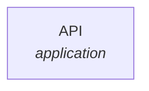

# PASTA Threat Model Report: cybrking/test-project

**Date**: 2026-02-19 | **Status**: 🟠 HIGH RISK

---

## Stage 1 & 2: Business Objectives & Technical Scope

*Defining why we care and what we are protecting.*

| Objective | Impact of Breach | Tech Context |
|-----------|-----------------|--------------|
| **Data Integrity** | High — Test | Node.js |

---

## Stage 3: Application Decomposition (DFD)

*The visual flow of data across trust boundaries.*

### Test Flow

**Data Classification**: PII

| Step | Component | Type | Protocol | Data |
|------|-----------|------|----------|------|
| 1 | API | application |  |  |

**Trust Boundaries:**

---

## Stage 4 & 5: Threat & Vulnerability Analysis

*Combining external threats with this repo's specific weaknesses.*

### API

- **Vector**: HTTP
- **Weakness**: No auth

| | |
|---|---|
| **Vulnerability** | `[V-001]` — Test vuln |
| **Severity** | 🔴 **Critical** |
| **Description** | Test |

---

## Stage 6: Attack Modeling (Simulation)

*How an attacker would realistically exploit these gaps.*

### Scenario: Test Attack

**Objective**: Breach

1. **Exploitation**: Access API *(exploits: `V-001`)*

---

## Stage 7: Risk & Impact Analysis

*The bottom line for the business.*

###  Compliance ()

**Overall Score: %** | Compliant:  | Partial:  | Non-Compliant: 

| Control | Status | Coverage | Evidence |
|---------|--------|----------|----------|

---

## Tactical Recommendations

---
*Generated by [thr8](https://github.com/cybrking/thr8) — PASTA Threat Model Generator*
