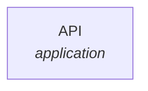

# Threat Model Report

**Generated**: 2026-02-18
**Compliance Frameworks**: 

## Executive Summary

| Metric | Value |
|--------|-------|
| Total Threats | 1 |
| Critical Risk | 0 |
| High Risk | 1 |
| Medium Risk | 0 |
| Low Risk | 0 |
| Unmitigated High Risk | 1 |
|  Score | % |

## System Architecture

## Data Flows

### Test Flow

**Data Classification**: PII

| Step | Component | Type | Protocol | Data |
|------|-----------|------|----------|------|
| 1 | API | application |  |  |

**Trust Boundaries:**

## Threat Analysis

### Express API (process)

#### [T-001] Test threat

- **Category**: Spoofing
- **Risk Score**: 7/10
- **Likelihood**: Medium | **Impact**: High
- **Residual Risk**: High

Test

**Mitigations:**

## Compliance Assessment

###  ()

**Overall Score: %** | Compliant:  | Partial:  | Non-Compliant: 

| Control | Status | Coverage | Evidence |
|---------|--------|----------|----------|

## Recommendations

---
*Generated by Threat Model Generator Action*
